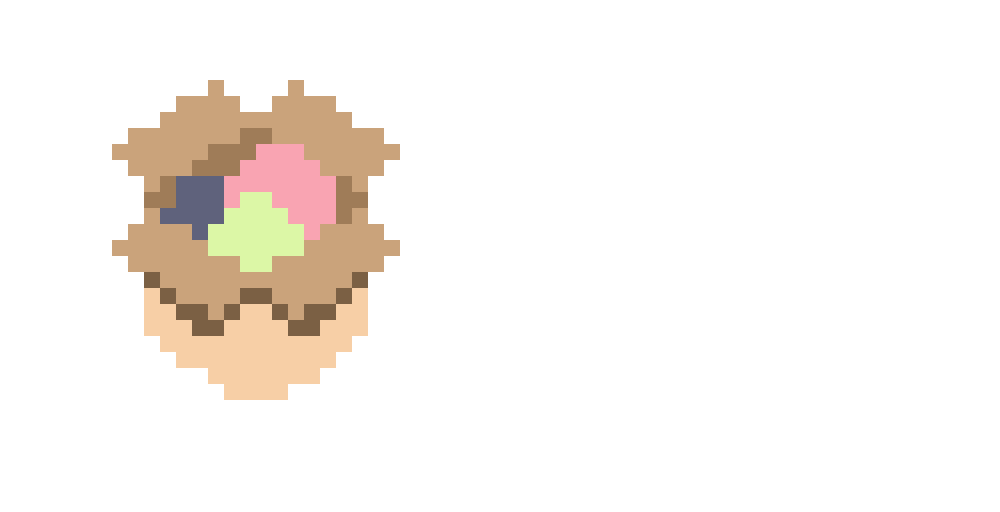

# wares



*wares* is a declarative AppImage/binary package manager!

## Installation

### Downloading wares

To install, just grab the binary for your operating system from the **Releases** section on the right.

### Setting up wares

Run the following to check that everything is in order:

```shell
/path/to/wares doctor
```

If it tells you that ~/Wares is not in your `$PATH`, please add it.

### Letting wares manage itself

Then, create `~/.config/wares` and paste the following into `~/.config/wares/config.yaml`:

```yaml
wares:
  wares:
    name: wares
    repo: indium114/wares
    asset: "wares_Linux_x86_64"
```

Replace `Linux_x86_64` with `Darwin_aarch64` if you're on a Mac with Apple Silicon, or `Darwin_x86_64` if you're on an Intel Mac.

Then, run `/path/to/wares sync` to download Wares, and it will now manage itself.

## Usage

### Installing a package

To install a package, add it to the `wares` section of `config.yaml`.


#### Installing an AppImage or Binary

For example, here's me installing [Helix](https://github.com/helix-editor/helix) using wares

```yaml
wares:
  hx:
    name: hx                 # Name of the program
    repo: helix-editor/helix # GitHub repo (without github.com)
    asset: "*.AppImage"      # Pattern which will match the downloaded asset you would like
                               # For example, using "*Linux-x86_64*" will match with any file containing the substring `Linux-x86_64` in its name
```


#### Installing an Archive

Installing an Archive (.tar.gz) is the same as installing as installing an AppImage.

In this example, I'll be installing [Lazygit](https://github.com/jesseduffield/lazygit), which is packaged in `.tar.gz` format

```yaml
wares:
  lazygit:
    name: lazygit                          # Name of the executable file inside .tar.gz archive that you want to use
    repo: jesseduffield/lazygit            # GitHub repo (without github.com)
    asset: "lazygit_*_linux_x86_64.tar.gz" # Pattern which will match the downloaded asset you would like
                                             # For example, using "*Linux-x86_64*" will match with any file containing the substring `Linux-x86_64` in its name
```

##### Removing top-level directory

Some `.tar.gz`-archived packages may include a top-level directory, usually named the same things as the archive itself.

To remedy this, you can set `removetoplevel: true` under a ware.

In this example, I'll be installing the [GitHub CLI](https://github.com/cli/cli), which is packaged like this.

```yaml
wares:
  gh:
    name: bin/gh
    repo: cli/cli
    asset: "gh_*_linux_amd64.tar.gz"
    removetoplevel: true # This is the important part for this archive.
```

If you want to know if a particular package does this or not, download and extract the archive for yourself.

#### Installing a package with Multiple Artifacts

If your package has multiple files that *all* need to be symlinked, you can use the `multiple` attribute.

When using `multiple`, a new directory named after the package will be created, into which the contents of the archive will be symlinked.
> Ensure that `~/Wares/<package name>` is in your **$PATH** for this to work.

In this example, I'll be installing [Cubyz](https://github.com/PixelGuys/Cubyz), which is packaged in `.tar.gz` format and requires multiple artifacts.


```yaml
wares:
  Cubyz:                         # Name of the directory that the artifacts will be symlinked into inside ~/Wares
    name: Cubyz                  # Not very useful for multi-artifact, but can't be empty
    repo: pixelguys/cubyz        # GitHub repo (without github.com)
    multiple: true               # Denotes that *all* files in the archive must be symlinked
    asset: "Linux-x86_64.tar.gz" # Pattern which will match the downloaded asset you would like
                                   # For example, using "*Linux-x86_64*" will match with any file containing the substring `Linux-x86_64` in its name
```

### Managing distro packages

`wares` can manage your distro's package manager as well, allowing you to declaratively install packages from *apt*, *pacman*, *flatpak*, etc.

#### Configuring managers

To configure a manager, add it to the `settings:managers` section of `config.yaml`.

In this example, I'll configure `flatpak`.

```yaml
settings:
  managers:
    flatpak:                         # Name of the package manager
      install: "flatpak install -y"  # Command to install a package
      remove: "flatpak uninstall -y" # Command to remove a package
      update: "flatpak update -y"    # Command to update all installed packages
```

#### Installing distro packages

Now that your *manager* is configured, let's install a package!

This is done in the `managers:<manager_name>` section of `config.yaml`.

In this example, I'll be installing *Resources* (`net.nokyan.Resources`) as a `flatpak`.

```yaml
managers:
  flatpak:                   # Name of the package manager (set earlier in settings:managers)
    - "net.nokyan.Resources" # Package to install
```

### Updating packages

To update packages, run the following command:

```shell
wares update
```

This will update the version in `pallet.lock`. Now just sync to install the new version:

```shell
wares sync
```
